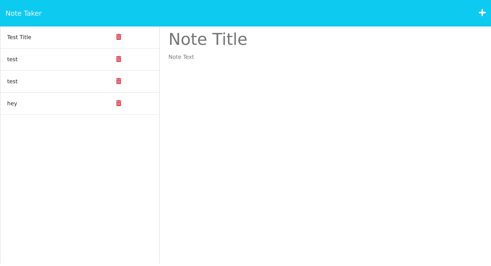

# Note-Taker

## Description

This week 11 assingment was to implement get routes to post a note and save it.
the technology that was used was express, requiring the 3001 local host port as well as being deployed on heroku. the starter code enabled the functionality, all that was required was to get the get routes implemented.

## Screenshot

## Deployed Website

[Heroku Deployed App](https://murmuring-badlands-33690.herokuapp.com/notes)
